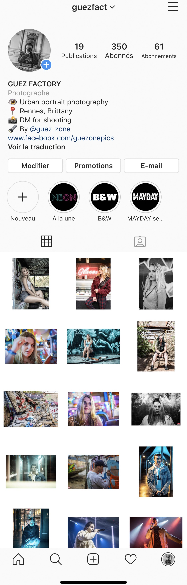

# InstaSize 

> Version 1.0 - Mac OS X application. Contact me with the coordinates at the bottom of the page to get the Mac OS X ".app" application !!
 
**InstaSize is a program to add borders to your images to keep an Instagram feed with a "paper" effect on your images. All portrait images processed by the program have the same size of top/bottom borders and the landscapes have the same size of left/right borders to have uniform images. The processed images form squares.. If you want an airy feed, this app will save you !**

## Requirements 
- Mac OS X 10.14 Mojave and earlier  
- Python 3.7
## Variable parameters 
### Border Size:
In the addBorder () function, you can change the pixel size of the borders, here are the default values:
- Portrait orientation (up / down borders): 230px
- Landscape orientation (left / right borders): 200px
Note: if you change the value in each program calculation operation, your image will always be a square.
### Format of the files:
- You can change the type of files to process by replacing the ".jpg" strings (ex: change to ".png")
### Other possible modifications:
- You can modify the text appearing in each window of the GUI

## Notes 
- The directory paths where your source / destination images are stored must not contain spaces. 
Support for Windows paths with spaces is an evolution in progress.

- Sometimes, because of a bug, the folder selection buttons do not display text. 
Resize the window with the mouse and the text appears (only with the .app)
- Version 1.1 will support blank spaces and thus create a Windows executable

## Result 

  

## Contact me

 - Join the chat 
 - Send me an e-mail : guezpics@gmail.com
 - Follow me on Instagram : @guezfact & @guez_zone
